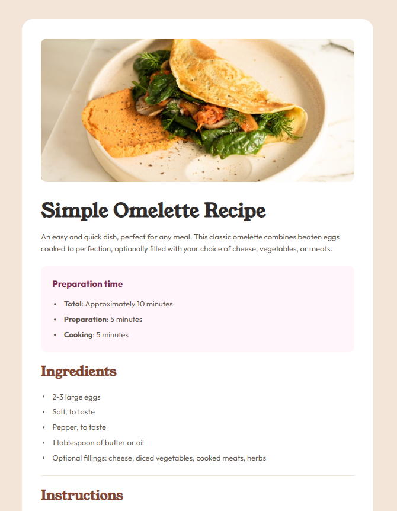
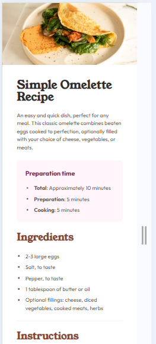

# Frontend Mentor - Recipe page solution

I built this project as my solution to the [Recipe page challenge on Frontend Mentor](https://www.frontendmentor.io/challenges/recipe-page-KiTsR8QQKm). I used it to practise semantic HTML, SCSS organization, design tokens, and fluid sizing with `clamp()`.

## Table of contents

- [Overview](#overview)
  - [The challenge](#the-challenge)
  - [Screenshot](#screenshot)
  - [Links](#links)
- [My process](#my-process)
  - [Built with](#built-with)
  - [What I learned](#what-i-learned)
  - [Continued development](#continued-development)
  - [Useful resources](#useful-resources)
  - [AI collaboration](#ai-collaboration)
- [Author](#author)
- [Acknowledgments](#acknowledgments)

## Overview

### The challenge

I needed to build a responsive recipe page that matched the supplied design as closely as possible. That included:

- structuring the page with clear semantic HTML
- styling the preparation section, ingredients list, instruction list, and nutrition table
- making the layout work cleanly across mobile and larger screen sizes
- keeping the styling organized and maintainable as I refactored

### Screenshot




### Links

- Solution URL: [GitHub repository](https://github.com/HenriBranken/fem-recipe-page)
- Live Site URL: [GitHub Pages](https://henribranken.github.io/fem-recipe-page)

## My process

I started with the basic HTML markup and design tokens, then moved into typography and layout. After that, I refined the table, list styling, separators, and spacing. Once I had a solid first working draft, I focused on cleanup and maintainability by renaming tokens more clearly, checking for dead tokens, scoping styles more intentionally, and refactoring repeated Sass logic from mixins into functions.

### Built with

- Semantic HTML5 markup
- SCSS partials with `@use`
- CSS custom properties for tokens
- Flexbox
- Fluid sizing with `clamp()`
- CSS pseudo-elements and counters
- A small, component-oriented Sass structure

### What I learned

One of the biggest things I learned was that naming matters just as much as styling. A few of my commits were focused entirely on improving token names like `--available-1` and `--stepdown-1`, and that made the fluid sizing logic much easier to reason about later.

I also learned that a Sass `@function` was a better fit than a mixin for repeated fluid calculations. I originally refactored some of the repeated logic into mixins, but then I pushed that one step further and converted the repeated formulas into functions so I could return values directly and keep the calling code cleaner.

Here is the kind of refactor that helped simplify the project:

```scss
@function fluid-between(
  $min-token,
  $max-token,
  $available-token,
  $stepdown-token
) {
  @return clamp(
    var(#{$min-token}),
    calc(
      var(#{$min-token}) + var(#{$available-token}) *
        calc(
          (var(#{$max-token}) - var(#{$min-token})) / var(#{$stepdown-token})
        )
    ),
    var(#{$max-token})
  );
}
```

I also got a better feel for the kinds of small browser-default details that can trip up a design. A good example was the tiny wedge that appeared on the `hr` elements, which I fixed by resetting the default border before applying my custom top border.

### Continued development

Going forward, I would like to keep improving three things:

- I want to set up a cleaner SCSS-to-CSS workflow so the compiled files stay consistent automatically.
- I want to keep refining how I split base styles, page styles, and component styles into partials.
- I want to continue practising reusable Sass helpers so I can recognize earlier when a repeated pattern should become a function or mixin.

### Useful resources

- [Frontend Mentor challenge brief](https://www.frontendmentor.io/challenges/recipe-page-KiTsR8QQKm) - I used this as the core reference for the layout and styling goals.
- [Sass `@function` documentation](https://sass-lang.com/documentation/at-rules/function) - This helped me understand when returning a value was cleaner than outputting declarations with a mixin.
- [Sass `@use` documentation](https://sass-lang.com/documentation/at-rules/use/) - This was useful while organizing my SCSS into partials.
- [MDN `clamp()` documentation](https://developer.mozilla.org/en-US/docs/Web/CSS/clamp) - This helped me think more clearly about fluid values for type, spacing, and sizing.
- [MDN guide on CSS counters](https://developer.mozilla.org/en-US/docs/Web/CSS/Guides/Counter_styles/Using_counters) - I found this helpful when working on the instruction list numbering.

### AI collaboration

I used AI as a coding partner while refining the project. It was most useful when I wanted a second set of eyes on maintainability rather than just syntax. In particular, I used it to:

- identify unused tokens in my design system
- diagnose the unwanted triangle showing on my `hr` elements
- talk through whether a mixin or a function made more sense for repeated Sass formulas
- tighten up how I scoped and organized some of my partials

I still made the final decisions on naming, structure, and what to keep, but the back-and-forth was useful for speeding up the cleanup and refactoring steps.

## Author

- GitHub - [HenriBranken](https://github.com/HenriBranken)

## Acknowledgments

I would like to thank Frontend Mentor for the challenge brief and design assets. This was a small project, but it gave me a useful space to practise writing cleaner SCSS, making incremental commits, and revisiting my code for refactoring instead of stopping at the first working version.
